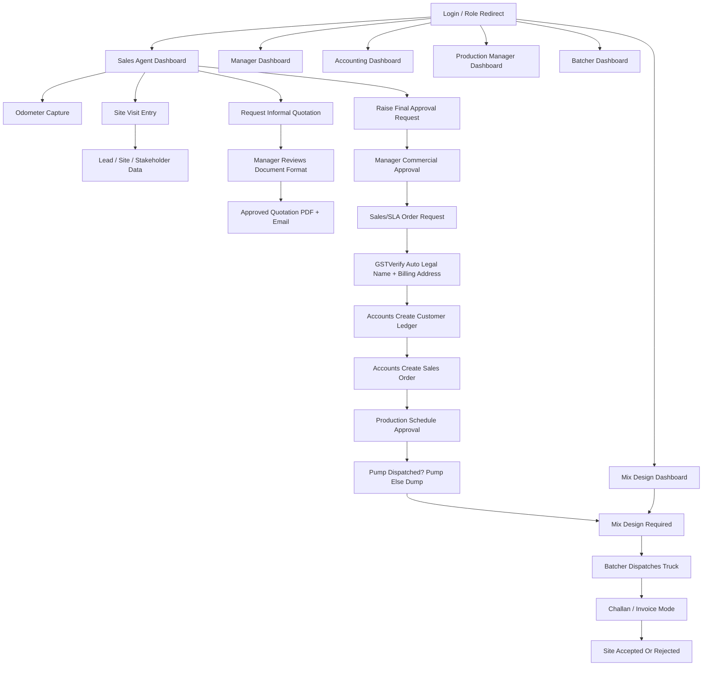

# SPD Field Sales Application: Current Workflow And UI Design Baseline

Last updated: 2026-05-09

This document describes the current product workflow and the existing interface design so the next UI upgrade can be planned without breaking the business process.

## Product Purpose

The application is an internal SPD Concrete field-sales and operations workflow system. It connects sales agents, managers, accounts, QC/mix design, production managers, and batchers through one role-based web application.

The current app is not only a sales CRM. It also handles:

- Daily sales-agent attendance and odometer evidence.
- Site visit reporting with GPS/photo/voice context.
- Lead, site, stakeholder, and follow-up tracking.
- Informal quotation request and manager approval.
- Final approval and sales order request.
- GST legal verification and accounts ledger creation.
- Production schedule approval and pump/dump confirmation.
- Batcher dispatch, challan/invoice mode selection, and site acceptance/rejection.
- Reimbursement claim, OTP confirmation, and accounting export support.

## Active Roles And Dashboards

| Role | Route | Main Owner | Current Purpose |
|---|---|---|---|
| Sales Agent | `/agent` | Salesperson | Daily field workflow, site visit, quotation request, approval request, sales order request, reimbursement support. |
| Sales Manager | `/manager` | Sales Manager | Command center, tracking, approvals, verifications, corrections, targets, tasks. |
| Accounting | `/accounting` | Accounts Person | Reimbursement claims, OTP payment verification, ledger creation, sales order creation, Tally/commission support. |
| Production Manager | `/production` | Production Manager | Approve production schedules and confirm pump/dump execution before dispatch. |
| Batcher | `/batcher` | Plant Batcher | Dispatch approved orders by truck, driver, quantity, challan/invoice mode, and site status. |
| Mix Design | `/mix-design` | QC / Mix Design | Create and maintain concrete mix designs by plant and grade. |

## Current Workflow Overview

## Sales Agent Workflow

The sales agent dashboard uses an accordion-style action center. Current sections are:

1. Odometer Capture
2. Site Visit Entry
3. Get Instant Price
4. Request Informal Quotation
5. Raise Approval Request
6. Create Sales/SLA Order
7. Sales Order Status
8. Help / Correction Request

### Odometer Capture

- Agent uploads or captures start/end odometer photo.
- The photo can be captured live or uploaded from gallery.
- GPS/photo metadata is used where available.
- OCR/manual confirmation flow stores the reading.
- Manager/manual verification can handle exceptions.

### Site Visit Entry

- Agent chooses existing/new lead and existing/new site.
- Agent records stakeholder details, supplier, concrete grade, quantity, expected supply window, future scope, remarks, and follow-up.
- If previous site visit found no one, the saved stakeholder option may include `Found no one`.
- Multiple stakeholders are supported in stored site data.
- Voice note transcript can be edited before submit.
- Submitted site visit reports can be viewed and edited later from logs.
- Past photo handling uses the uploaded photo/watermark data rather than blindly treating every upload as today's live capture.

### Informal Quotation Request

- Agent selects existing lead, site, and stakeholder.
- Stakeholder email is mandatory.
- Billing address can be same as site or manually entered.
- WhatsApp number can be stakeholder number or a custom number.
- Up to three concrete grades can be requested at once.
- Quantity, price, and mix design requirement are captured per grade.
- GST-inclusive and non-GST price types are supported.
- Credit payment is blocked for non-GST quotations.
- Agent cannot download or directly send the quotation.
- Manager reviews the request in a document-like format.
- On approval, a quotation reference is generated by financial year and sequence.
- Current system generates PDF, stores it, and sends email if email/S3 configuration is available.
- WhatsApp delivery is still marked as pending configuration until the WhatsApp delivery service is connected.

### Final Approval And Sales Order Request

- Agent raises final approval from lead/site commercial context.
- Manager approves or rejects the final commercial approval.
- Agent creates a Sales/SLA order request only from approved terms.
- Agent enters GSTIN or certificate details if it is a GST order.
- GSTVerify integration can auto-fetch legal business name and billing address.
- Agent must confirm GST legal details before submitting.
- If GSTIN is not provided, dispatch remains challan-only.

## Manager Workflow

The manager area is split into focused pages:

| Section | Route | Purpose |
|---|---|---|
| Overview | `/manager` | Main command center with plant snapshots and workspace links. |
| Tracking | `/manager/tracking` | Sales-agent daily activity, sessions, visits, locations, and day summaries. |
| Approvals | `/manager/approvals` | Final approval and informal quotation decisions. |
| Verifications | `/manager/verifications` | Odometer/manual review queue. |
| Corrections | `/manager/corrections` | Agent help/correction requests. |
| Targets | `/manager/targets` | Monthly target management. |
| Tasks | `/manager/tasks` | Secondary task assignment and tracking. |
| Orders | `/manager/orders` | Currently a handoff notice because production scheduling moved to Production Manager. |

Manager decisions currently cover:

- Approving/rejecting final price approval requests.
- Reviewing informal quotation requests in document format.
- Resolving odometer/manual verification exceptions.
- Reviewing field activity and site visits.
- Setting targets and assigning tasks.

## Accounting Workflow

The accounting dashboard currently has department tabs:

- Sales Department
- Commission & Vouchers
- Production Department
- HR Department
- Labor Department

The important sales-order sections are:

1. Create New Ledger
2. Create Sales Order
3. Sales Order Pipeline

### Ledger Creation

- Sales order requests from agents arrive as pending ledger requests.
- Accounts verifies GST, legal name, billing address, PO/PDC/payment documents, and ledger readiness.
- If approved, request status becomes ledger-created.
- GST verification status is marked verified when Accounts approves a GST-backed request.

### Sales Order Creation

- Ledger-created requests appear in the Create Sales Order section.
- Accounts creates the formal sales order.
- The request moves to the Production Manager dashboard for schedule approval.

### Reimbursement And OTP Payment

- Sales-agent reimbursement claims appear in accounting.
- Accounts can send OTP to the sales agent.
- Payment is marked paid only after OTP verification.
- Reimbursement exports support CSV/XLSX.

## Production Manager Workflow

Production manager receives sales orders created by Accounts.

Current responsibilities:

- Review schedule-pending orders.
- Approve or reject the production schedule.
- Confirm whether pump was actually dispatched.
- If pump is dispatched, actual casting type becomes pump.
- If pump is not dispatched, actual casting type becomes dump.
- Pump/dump decision controls dispatch and invoice/challan context.

## Mix Design Workflow

The mix design dashboard maintains active recipes by plant and concrete grade.

Batcher dispatch requires:

- A production-approved sales order.
- An active mix design for the order grade and plant.
- Available vehicle and dispatch quantity.

## Batcher Workflow

Batcher dashboard is plant-scoped.

Current dispatch flow:

1. Select approved sales order.
2. Select idle truck.
3. Enter dispatch quantity.
4. Enter driver name and phone.
5. Choose document mode:
   - Challan only
   - Challan + invoice
   - Challan + GST invoice/e-invoice
6. Invoice modes are available only when GSTIN is verified.
7. Confirm dispatch.
8. Site later marks challan as accepted or rejected.
9. Rejected dispatch quantity returns to the order for review.

Important current rule:

- If the order has no verified GSTIN, batcher can only create challan-only dispatch.

## Current Integrations

| Integration | Current State |
|---|---|
| Firebase / Firestore | Primary persistent app data when configured. |
| S3 | Used for durable file uploads and generated quotation PDFs when configured. |
| GSTVerify | Backend API route can fetch GST legal name, PAN, status, and billing address from GSTIN. |
| Gmail SMTP | Used for quotation email delivery when configured. |
| Odoo | Backend connection health exists; future use planned for accounting/tally/e-invoice/signature workflows. |
| WhatsApp | Delivery planned; current quotation status can show pending configuration. |
| OCR / AI | Used for odometer/site-visit/photo/voice assistance where configured. |

## Current UI Design Baseline

The current UI is a responsive web dashboard built with Next.js App Router and shared React components.

### Layout Model

- Shared `AppShell` wraps all dashboards.
- Top hero area shows role, page title, subtitle, user identity, employee ID, current time, and auto-sync status.
- Dashboards use panels, metric cards, summary cells, data rows, accordions, and tables.
- Manager dashboard uses section navigation and workspace cards.
- Sales agent dashboard uses a single accordion workflow.
- Accounting uses department tabs.
- Batcher uses form panels and dispatch table.

### Current Visual Tokens

Primary tokens are defined in `app/globals.css`.

| Token | Current Value | Usage |
|---|---|---|
| `--bg` | `#f6f4ef` | Page background base. |
| `--surface` | `rgba(255,255,255,0.82)` | Panels and cards. |
| `--surface-strong` | `#ffffff` | Stronger cards/inputs. |
| `--ink` | `#112031` | Primary text. |
| `--muted` | `#546477` | Secondary text. |
| `--line` | `rgba(17,32,49,0.12)` | Borders. |
| `--brand` | `#10233f` | Dark navy brand. |
| `--brand-soft` | `#d8e6ff` | Soft brand surfaces. |
| `--accent` | `#f59e0b` | Amber action/accent. |
| `--success` | `#0f766e` | Success states. |
| `--danger` | `#b91c1c` | Error/danger states. |
| `--warning` | `#b45309` | Warning states. |
| `--radius` | `24px` | Rounded panel geometry. |
| `--font-body` | `Segoe UI`, `Helvetica Neue`, sans-serif | Current type system. |

### Current UI Character

- Warm off-white background.
- Dark navy gradient hero blocks.
- Glass-like white cards with blur and soft shadows.
- Rounded panels and controls.
- Dense but readable operational dashboards.
- Status badges for workflow state.
- Form-heavy screens with multiple grids and data rows.

### Current UI Weaknesses To Address

- Many dashboards visually feel similar because panels, cards, and rows repeat heavily.
- Long forms need better step grouping and progressive disclosure.
- Sales-agent workflow is functionally clear but visually dense on mobile.
- Manager pages need stronger information hierarchy between decision work and reporting.
- Accounting needs clearer separation between reimbursement, ledger, sales order, and voucher work.
- Batcher needs a more command-center style dispatch screen with clearer "ready / blocked / dispatched" states.
- Mix design could use a recipe-table/editor visual language rather than generic dashboard cards.
- Status and audit trail should become timeline components instead of scattered text rows.
- Some old text has encoding artifacts (`₹`) that should be cleaned during UI refresh.
- The app recently gained auto-refresh; UI should make live-sync state clearer and less noisy.

## UI Upgrade Direction

The next UI upgrade should preserve all workflows but redesign the interface around role-specific command centers.

### Design Principles

- Make every dashboard answer: "What needs my action right now?"
- Use role-specific navigation instead of one generic dashboard feeling.
- Convert long forms into guided step flows.
- Replace scattered status text with consistent status timelines.
- Keep business-critical data visible, but reduce visual noise.
- Design mobile-first for sales agents.
- Design desktop command-center views for manager, accounts, production, and batcher.
- Keep all controls code-native and accessible.

### Recommended Visual Direction

Use an industrial operations design language:

- Background: concrete/off-white base with subtle blueprint or aggregate texture.
- Primary color: deep navy / graphite.
- Accent: safety amber / concrete orange.
- Secondary colors: teal for verified, red for blocked, slate for pending.
- Typography: stronger dashboard type system than Segoe UI; consider `Sora`, `Manrope`, `Aptos`, or `IBM Plex Sans`.
- Components: fewer nested cards, more rails, work queues, timelines, split panes, and document previews.
- Motion: subtle workflow transitions, queue updates, accordion reveal, and status changes.

### Role-Specific Upgrade Ideas

#### Sales Agent

- Mobile-first "Today's Route" home.
- Large primary action cards for odometer and site visit.
- Site visit as a guided wizard:
  - Lead/site
  - Stakeholder
  - Photo/GPS
  - Concrete details
  - Remarks/voice
  - Review and submit
- Sticky draft/save state.
- Better post-submit report preview and edit entry point.

#### Manager

- Command center with urgent decisions first.
- Side navigation for tracking, approvals, verifications, corrections, targets, tasks.
- Approval pages should look like document review desks.
- Tracking page should become a timeline/map/agent roster workspace.

#### Accounting

- Separate work queues:
  - Claims
  - Create Ledger
  - Create Sales Order
  - Commission/Vouchers
  - Exports
- Ledger requests should have a checklist UI:
  - GST verified
  - Legal name verified
  - Billing address verified
  - PO/PDC/payment evidence checked
  - Formal quotation sent

#### Production Manager

- Schedule board with today/tomorrow/blocked columns.
- Pump/dump decision as a clear operational toggle with confirmation details.
- Show order quantity, remaining quantity, grade, plant, truck readiness, and mix design status.

#### Batcher

- Dispatch command screen:
  - Order queue
  - Truck selector
  - Quantity control
  - Driver details
  - Document mode
  - Dispatch confirmation
- Show blocking reasons clearly:
  - No active mix design
  - No verified GSTIN
  - No idle truck
  - Quantity exceeds remaining

#### Mix Design

- Recipe library by plant and grade.
- Active/inactive status should be obvious.
- Use table editor or side panel instead of generic card-heavy forms.

## Suggested Design System For Upgrade

### Core Components

- App shell with role-specific sidebar or compact mobile top nav.
- Work queue card.
- Status timeline.
- Document preview panel.
- Guided wizard stepper.
- Form section block.
- Data row with primary/secondary/action slots.
- Decision footer for approve/reject actions.
- Empty state and blocked state components.
- Auto-sync indicator.

### Workflow Status Language

Use consistent status groups:

- Draft
- Pending
- Needs Review
- Approved
- Rejected
- Created
- Scheduled
- Dispatched
- Accepted
- Blocked

### Redesign Safety Rules

- Do not remove any role or route.
- Do not change approval authority.
- Do not give sales agents download access to quotations.
- Do not unlock invoice/e-invoice modes without verified GSTIN.
- Do not bypass Accounts ledger creation.
- Do not move production scheduling back to Sales Manager.
- Preserve GPS/photo evidence flow.
- Preserve audit logs and status history.

## Immediate UI Upgrade Plan

1. Create a visual concept for the upgraded shared shell and one role dashboard.
2. Start with Sales Agent mobile-first workflow because it is the most used screen.
3. Then redesign Accounting because ledger/sales-order handoff is now critical.
4. Then redesign Production Manager and Batcher together because their workflow is connected.
5. Finally redesign Manager overview/tracking/approvals.
6. Keep each workflow functional after every page upgrade.

## Files Most Relevant To UI Upgrade

| Area | Main Files |
|---|---|
| Shared shell and dashboard chrome | `src/components/AppShell.tsx`, `src/components/DashboardAutoRefresh.tsx`, `app/globals.css` |
| Sales Agent dashboard | `app/agent/page.tsx`, `src/components/agent/AgentActions.tsx`, `src/components/agent/SiteVisitFlowCard.tsx`, `src/components/agent/CommercialRequestCards.tsx` |
| Informal quotation | `src/components/agent/InformalQuotationRequestCard.tsx`, `src/components/manager/InformalQuotationDecisionCard.tsx` |
| Manager dashboard | `app/manager/page.tsx`, `src/components/manager/ManagerSectionNav.tsx`, `src/components/manager/ManagerTrackingWorkspace.tsx`, `src/components/manager/ManagerSalesOrderActions.tsx` |
| Accounting dashboard | `app/accounting/page.tsx`, `src/components/accounting/AccountingWorkspace.tsx`, `src/components/accounting/AccountingSalesOrderVerification.tsx` |
| Production dashboard | `app/production/page.tsx`, `src/components/manager/ManagerSalesOrderActions.tsx` |
| Batcher dashboard | `app/batcher/page.tsx`, `src/components/batcher/BatcherWorkspace.tsx` |
| Mix Design dashboard | `app/mix-design/page.tsx`, `src/components/manager/MixDesignMaster.tsx` |
| Workflow/business logic | `src/lib/repository.ts`, `src/lib/commercial.ts`, `src/lib/legal-workflow.ts`, `src/lib/types.ts` |
